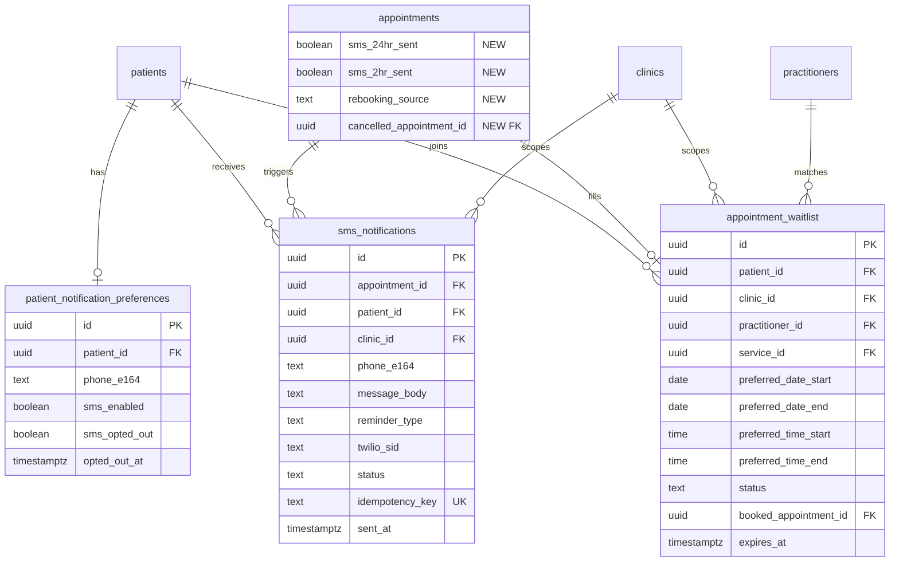

# Phase 1: Revenue Protection

## Overview

Implement four interconnected features that protect clinic revenue by reducing no-shows, filling cancelled slots, and providing visibility into appointment performance. All features follow API-Route-Driven architecture with TypeScript business logic in Next.js API routes.

**Timeline:** 1-2 weeks (MVP)
**Architecture:** API-Route-Driven (see brainstorm: `docs/brainstorms/2026-04-24-phase1-revenue-protection-brainstorm.md`)

## Problem Statement

Clinics lose significant revenue from no-shows and unfilled cancellation slots. There is no proactive reminder system (email triggers exist but no SMS), no mechanism to fill cancelled slots, and no analytics to quantify the problem. The current system is reactive — it marks no-shows after the fact but does nothing to prevent them.

## Proposed Solution

1. **Smart SMS Reminders** — Twilio SMS at 24h and 2h before appointments. Reply-based confirm/cancel.
2. **Auto Rebooking Engine** — On cancellation, suggest next available slots to the patient via SMS.
3. **Waitlist System** — First-come auto-book when slots open from cancellations.
4. **Basic Analytics** — No-show rate, revenue lost, peak hours, confirmation rate on clinic dashboard.

## Technical Approach

### Architecture

```
┌─────────────────────────────────────────────────────────┐
│                    Vercel Cron (GET)                     │
│                  every 15 min (Pro plan)                 │
└────────────────────────┬────────────────────────────────┘
                         │
                         v
┌─────────────────────────────────────────────────────────┐
│              Next.js API Routes (TypeScript)             │
│                                                         │
│  /api/cron/send-reminders          (Cron → SMS)         │
│  /api/cron/expire-waitlist         (Cron → cleanup)     │
│  /api/webhooks/twilio/incoming     (SMS replies)        │
│  /api/webhooks/twilio/status       (Delivery status)    │
│  /api/clinic/[clinicId]/waitlist   (CRUD)               │
│  /api/clinic/[clinicId]/analytics  (Dashboard stats)    │
│  /api/appointments/[id]/cancel     (Cancel + triggers)  │
│  /api/appointments/[id]/confirm    (Confirm via token)  │
└────────────┬───────────────────────────────┬────────────┘
             │                               │
             v                               v
┌────────────────────────┐    ┌──────────────────────────┐
│   Supabase (PostgreSQL) │    │     Twilio SMS API       │
│   supabaseAdmin client  │    │  PH local number (+63)   │
│   RLS for reads         │    │  Webhook for replies     │
└────────────────────────┘    └──────────────────────────┘
```

### Prerequisites (Must Complete First)

**P0: Refactor appointment cancellation to API route.** The current `useUpdateAppointment.ts` hook mutates appointments directly via Supabase client — violating CLAUDE.md. All Phase 1 features trigger on cancellation, so this flow MUST go through a server-side API route where rebooking + waitlist logic can execute.

**P0: Phone number normalization.** The `patients.phone` field is unstructured TEXT. Philippine numbers appear as `09XX`, `+639XX`, or `639XX`. A normalization utility must convert all formats to E.164 (`+639XXXXXXXXX`) before any SMS can be sent.

### Implementation Phases

---

#### Phase 1: Foundation (Days 1-2)

Database migrations, Twilio setup, and critical refactors that all features depend on.

##### 1.1 Database Migration: New Tables and Columns

**File:** `supabase/migrations/2026XXXX_phase1_revenue_protection.sql`

```sql
-- Patient notification preferences
CREATE TABLE public.patient_notification_preferences (
  id UUID PRIMARY KEY DEFAULT gen_random_uuid(),
  patient_id UUID NOT NULL REFERENCES public.patients(id) ON DELETE CASCADE,
  phone_e164 TEXT,
  sms_enabled BOOLEAN DEFAULT true,
  sms_opted_out BOOLEAN DEFAULT false,
  opted_out_at TIMESTAMPTZ,
  created_at TIMESTAMPTZ DEFAULT now(),
  updated_at TIMESTAMPTZ DEFAULT now(),
  UNIQUE (patient_id)
);

-- SMS notification tracking
CREATE TABLE public.sms_notifications (
  id UUID PRIMARY KEY DEFAULT gen_random_uuid(),
  appointment_id UUID REFERENCES public.appointments(id) ON DELETE SET NULL,
  patient_id UUID NOT NULL REFERENCES public.patients(id),
  clinic_id UUID NOT NULL REFERENCES public.clinics(id),
  phone_e164 TEXT NOT NULL,
  message_body TEXT NOT NULL,
  reminder_type TEXT NOT NULL CHECK (reminder_type IN ('24h', '2h', 'rebooking', 'waitlist_booked', 'custom')),
  twilio_sid TEXT,
  status TEXT DEFAULT 'pending' CHECK (status IN ('pending', 'sent', 'delivered', 'failed', 'undelivered')),
  idempotency_key TEXT UNIQUE,
  sent_at TIMESTAMPTZ,
  created_at TIMESTAMPTZ DEFAULT now()
);

-- Appointment waitlist
CREATE TABLE public.appointment_waitlist (
  id UUID PRIMARY KEY DEFAULT gen_random_uuid(),
  patient_id UUID NOT NULL REFERENCES public.patients(id),
  clinic_id UUID NOT NULL REFERENCES public.clinics(id),
  practitioner_id UUID REFERENCES public.practitioners(id),
  service_id UUID REFERENCES public.clinic_services(id),
  preferred_date_start DATE NOT NULL,
  preferred_date_end DATE NOT NULL,
  preferred_time_start TIME,
  preferred_time_end TIME,
  status TEXT DEFAULT 'waiting' CHECK (status IN ('waiting', 'booked', 'expired', 'cancelled')),
  booked_appointment_id UUID REFERENCES public.appointments(id),
  notes TEXT,
  expires_at TIMESTAMPTZ DEFAULT (now() + interval '30 days'),
  created_at TIMESTAMPTZ DEFAULT now(),
  updated_at TIMESTAMPTZ DEFAULT now()
);

-- Indexes
CREATE INDEX idx_sms_notifications_appointment ON public.sms_notifications(appointment_id);
CREATE INDEX idx_sms_notifications_status ON public.sms_notifications(status);
CREATE INDEX idx_sms_notifications_idempotency ON public.sms_notifications(idempotency_key);
CREATE INDEX idx_waitlist_status_clinic ON public.appointment_waitlist(clinic_id, status);
CREATE INDEX idx_waitlist_practitioner ON public.appointment_waitlist(practitioner_id, status);
CREATE INDEX idx_waitlist_expires ON public.appointment_waitlist(expires_at) WHERE status = 'waiting';
CREATE INDEX idx_patient_notification_prefs_patient ON public.patient_notification_preferences(patient_id);

-- SMS tracking flags on appointments
ALTER TABLE public.appointments
  ADD COLUMN IF NOT EXISTS sms_24hr_sent BOOLEAN DEFAULT false,
  ADD COLUMN IF NOT EXISTS sms_2hr_sent BOOLEAN DEFAULT false,
  ADD COLUMN IF NOT EXISTS rebooking_source TEXT,
  ADD COLUMN IF NOT EXISTS cancelled_appointment_id UUID REFERENCES public.appointments(id);

-- RLS policies
ALTER TABLE public.patient_notification_preferences ENABLE ROW LEVEL SECURITY;
ALTER TABLE public.sms_notifications ENABLE ROW LEVEL SECURITY;
ALTER TABLE public.appointment_waitlist ENABLE ROW LEVEL SECURITY;

-- Patients can read/update their own preferences
CREATE POLICY "patients_own_notification_prefs_select"
  ON public.patient_notification_preferences FOR SELECT TO authenticated
  USING (patient_id = get_patient_id_for_user());

CREATE POLICY "patients_own_notification_prefs_upsert"
  ON public.patient_notification_preferences FOR INSERT TO authenticated
  WITH CHECK (patient_id = get_patient_id_for_user());

CREATE POLICY "patients_own_notification_prefs_update"
  ON public.patient_notification_preferences FOR UPDATE TO authenticated
  USING (patient_id = get_patient_id_for_user());

-- Clinic admins can read SMS logs for their clinic
CREATE POLICY "sms_notifications_clinic_admin_select"
  ON public.sms_notifications FOR SELECT TO authenticated
  USING (
    EXISTS (
      SELECT 1 FROM public.clinic_admins ca
      WHERE ca.auth_user_id = auth.uid()
        AND ca.clinic_id = sms_notifications.clinic_id
        AND ca.is_active = true
    )
  );

-- Waitlist: patients can manage their own entries
CREATE POLICY "waitlist_patients_select"
  ON public.appointment_waitlist FOR SELECT TO authenticated
  USING (patient_id = get_patient_id_for_user());

CREATE POLICY "waitlist_patients_insert"
  ON public.appointment_waitlist FOR INSERT TO authenticated
  WITH CHECK (patient_id = get_patient_id_for_user());

CREATE POLICY "waitlist_patients_update"
  ON public.appointment_waitlist FOR UPDATE TO authenticated
  USING (patient_id = get_patient_id_for_user());

-- Waitlist: clinic admins can view/manage for their clinic
CREATE POLICY "waitlist_clinic_admin_select"
  ON public.appointment_waitlist FOR SELECT TO authenticated
  USING (
    EXISTS (
      SELECT 1 FROM public.clinic_admins ca
      WHERE ca.auth_user_id = auth.uid()
        AND ca.clinic_id = appointment_waitlist.clinic_id
        AND ca.is_active = true
    )
  );

CREATE POLICY "waitlist_clinic_admin_update"
  ON public.appointment_waitlist FOR UPDATE TO authenticated
  USING (
    EXISTS (
      SELECT 1 FROM public.clinic_admins ca
      WHERE ca.auth_user_id = auth.uid()
        AND ca.clinic_id = appointment_waitlist.clinic_id
        AND ca.is_active = true
    )
  );
```

##### 1.2 Twilio Client Library

**File:** `src/lib/twilio.ts`

```typescript
import twilio from 'twilio';

const client = twilio(
  process.env.TWILIO_ACCOUNT_SID!,
  process.env.TWILIO_AUTH_TOKEN!
);

export async function sendSMS(to: string, body: string): Promise<{ sid: string; status: string }> {
  const message = await client.messages.create({
    body,
    to,
    from: process.env.TWILIO_PHONE_NUMBER!,
    statusCallback: `${process.env.NEXT_PUBLIC_APP_URL}/api/webhooks/twilio/status`,
  });
  return { sid: message.sid, status: message.status };
}

export function validateTwilioSignature(signature: string, url: string, params: Record<string, string>): boolean {
  return twilio.validateRequest(
    process.env.TWILIO_AUTH_TOKEN!,
    signature,
    url,
    params
  );
}

export { twilio };
```

##### 1.3 Phone Number Normalization

**File:** `src/lib/phone.ts`

```typescript
export function normalizeToE164(phone: string | null): string | null {
  if (!phone) return null;
  const digits = phone.replace(/\D/g, '');
  // 09XX format (10 digits, PH local)
  if (digits.length === 10 && digits.startsWith('0')) {
    return `+63${digits.slice(1)}`;
  }
  // 639XX format (12 digits, no +)
  if (digits.length === 12 && digits.startsWith('63')) {
    return `+${digits}`;
  }
  // Already E.164
  if (digits.length === 11 && digits.startsWith('63')) {
    return `+${digits}`;
  }
  return null; // Invalid
}

export function isValidPHMobile(e164: string): boolean {
  return /^\+639\d{9}$/.test(e164);
}
```

##### 1.4 Refactor: Appointment Cancellation API Route

**File:** `src/app/api/appointments/[appointmentId]/cancel/route.ts`

This is the critical refactor — moves cancellation from direct Supabase client to API route, and becomes the trigger point for rebooking + waitlist logic.

```typescript
// POST /api/appointments/[appointmentId]/cancel
// Body: { reason?: string }
// Auth: Bearer token (patient who owns the appointment, or clinic admin)
//
// Side effects:
// 1. Sets appointment status to 'cancelled'
// 2. Logs activity
// 3. Triggers auto-rebooking SMS to cancelling patient
// 4. Triggers waitlist auto-book for the freed slot
```

##### 1.5 Vercel Cron Configuration

**File:** `vercel.json`

```json
{
  "crons": [
    {
      "path": "/api/cron/send-reminders",
      "schedule": "*/15 * * * *"
    },
    {
      "path": "/api/cron/expire-waitlist",
      "schedule": "0 3 * * *"
    }
  ]
}
```

##### 1.6 Environment Variables

Add to `.env.local` and Vercel dashboard:

```
TWILIO_ACCOUNT_SID=
TWILIO_AUTH_TOKEN=
TWILIO_PHONE_NUMBER=+63XXXXXXXXXX
CRON_SECRET=
```

---

#### Phase 2: Smart SMS Reminders (Days 3-5)

##### 2.1 Cron: Send Reminders

**File:** `src/app/api/cron/send-reminders/route.ts`

```
GET /api/cron/send-reminders
Auth: Bearer CRON_SECRET (Vercel Cron)

Logic:
1. Query appointments where:
   - status IN ('scheduled', 'confirmed')
   - appointment_date/time is 23-25 hours from now AND sms_24hr_sent = false
   - OR appointment_date/time is 1.5-2.5 hours from now AND sms_2hr_sent = false
   (Use UTC+8 timezone conversion for PH)
2. For each appointment:
   a. Look up patient_notification_preferences → check sms_enabled, sms_opted_out
   b. Get phone_e164 (from preferences table, fallback to normalized patients.phone)
   c. Skip if no valid phone or opted out
   d. Generate idempotency_key: `{appointment_id}:{reminder_type}`
   e. Insert into sms_notifications (with idempotency_key, ON CONFLICT DO NOTHING)
   f. Send SMS via Twilio
   g. Update sms_notifications with twilio_sid, status='sent'
   h. Set sms_24hr_sent=true or sms_2hr_sent=true on appointment
3. Return summary: { sent: N, skipped: N, failed: N }
```

**SMS template (24h):**
```
Hi {first_name}, reminder: {clinic_name} appt tomorrow {date} at {time}.
Reply C to confirm, X to cancel.
Reply STOP to opt out.
```

**SMS template (2h):**
```
Hi {first_name}, your appt at {clinic_name} is in 2 hours ({time}).
Reply C to confirm, X to cancel.
```

##### 2.2 Webhook: Incoming SMS Replies

**File:** `src/app/api/webhooks/twilio/incoming/route.ts`

```
POST /api/webhooks/twilio/incoming
Auth: Twilio signature validation (x-twilio-signature)
Content-Type: application/x-www-form-urlencoded

Logic:
1. Parse From (phone) and Body (message text) from Twilio params
2. Validate Twilio signature
3. Normalize the phone number to E.164
4. Look up patient by phone_e164 in patient_notification_preferences
5. Handle STOP/CANCEL/END/QUIT → set sms_opted_out=true, return TwiML ack
6. Handle "C" (confirm):
   a. Find the patient's next upcoming appointment (status='scheduled')
   b. Update status to 'confirmed'
   c. Return TwiML: "Confirmed! See you on {date} at {time}."
7. Handle "X" (cancel):
   a. Find the patient's next upcoming appointment
   b. Call the cancellation logic (same as /api/appointments/[id]/cancel)
   c. Return TwiML: "Cancelled. We'll send you rebooking options shortly."
8. Handle unrecognized → return TwiML: "Reply C to confirm or X to cancel your next appointment."

Edge case: Multiple upcoming appointments
→ Act on the soonest upcoming appointment. If ambiguous, reply with list.
```

##### 2.3 Webhook: Delivery Status

**File:** `src/app/api/webhooks/twilio/status/route.ts`

```
POST /api/webhooks/twilio/status
Auth: Twilio signature validation

Logic:
1. Parse MessageSid and MessageStatus from params
2. Update sms_notifications SET status = MessageStatus WHERE twilio_sid = MessageSid
```

##### 2.4 Frontend: Notification Preferences

**File:** `src/hooks/useNotificationPreferences.ts`

```
Hook for patients to view/update their SMS preferences:
- GET /api/patient/notification-preferences
- PUT /api/patient/notification-preferences
Fields: phone_e164, sms_enabled
```

**File:** `src/app/api/patient/notification-preferences/route.ts`

```
GET: Fetch patient's notification preferences
PUT: Update phone and sms_enabled flag
Auth: Bearer token, patient role only
```

Minimal UI: phone number input + SMS toggle on patient settings/profile page.

---

#### Phase 3: Waitlist + Auto Rebooking (Days 6-9)

These features are tightly coupled — cancellation triggers both.

##### 3.1 Cancellation Flow (The Orchestrator)

**File:** `src/app/api/appointments/[appointmentId]/cancel/route.ts`

```
POST /api/appointments/{id}/cancel
Auth: Bearer token (patient owner or clinic admin of the appointment's clinic)
Body: { reason?: string, source?: 'sms' | 'web' }

Sequential steps (all in one API route, using supabaseAdmin):
1. Verify appointment exists and is cancellable (status IN scheduled, confirmed)
2. Update appointment status = 'cancelled'
3. Log to activity_logs
4. WAITLIST AUTO-BOOK (synchronous, with locking):
   a. SELECT from appointment_waitlist WHERE:
      - clinic_id matches
      - practitioner_id matches (or is null = any practitioner)
      - service_id matches (or is null = any service)
      - preferred_date_start <= freed_date <= preferred_date_end
      - preferred_time_start/end overlap with freed time (if specified)
      - status = 'waiting'
      ORDER BY created_at ASC
      LIMIT 1
      FOR UPDATE SKIP LOCKED
   b. If match found:
      - Create new appointment for waitlisted patient (status='confirmed')
      - Update waitlist entry: status='booked', booked_appointment_id=new_appt_id
      - Send SMS: "Great news! You've been booked for {date} at {time} at {clinic}."
      - Return (skip rebooking SMS since slot is filled)
   c. If no match:
      - Proceed to auto-rebooking
5. AUTO-REBOOKING (only if waitlist didn't fill the slot):
   a. Get next 3 available slots via get_available_time_slots() RPC
      - Same practitioner, next 14 days
   b. If slots available:
      - Generate a signed rebooking token (JWT with appointment context, 72h expiry)
      - Send SMS: "Your appt was cancelled. Rebook: {link_with_token}"
      - Store rebooking token on a new rebook_tokens table or embed in URL
   c. If no slots: send SMS acknowledging cancellation only
```

**Priority order:** Waitlist auto-book > Rebooking SMS to original patient. This prevents the race condition identified in SpecFlow analysis.

##### 3.2 Waitlist API Routes

**File:** `src/app/api/clinic/[clinicId]/waitlist/route.ts`

```
GET /api/clinic/{clinicId}/waitlist
Auth: Clinic admin or practitioner of the clinic
Query params: ?status=waiting&practitioner_id=X
Returns: Waitlist entries with patient names, sorted by created_at

POST /api/clinic/{clinicId}/waitlist
Auth: Patient (self) or clinic admin
Body: {
  patient_id,
  practitioner_id?,
  service_id?,
  preferred_date_start,
  preferred_date_end,
  preferred_time_start?,
  preferred_time_end?,
  notes?
}
Validation:
- preferred_date_end >= preferred_date_start
- Date range <= 30 days
- No duplicate active waitlist entry for same patient+practitioner+service
```

**File:** `src/app/api/clinic/[clinicId]/waitlist/[waitlistId]/route.ts`

```
DELETE /api/clinic/{clinicId}/waitlist/{waitlistId}
Auth: Patient (own entry) or clinic admin
Sets status = 'cancelled'
```

##### 3.3 Cron: Expire Waitlist

**File:** `src/app/api/cron/expire-waitlist/route.ts`

```
GET /api/cron/expire-waitlist
Auth: Bearer CRON_SECRET
Runs: Daily at 3 AM UTC (11 AM PHT)

Logic:
1. UPDATE appointment_waitlist SET status='expired'
   WHERE status='waiting' AND expires_at < now()
2. Return { expired: N }
```

##### 3.4 Rebooking Confirmation Page

**File:** `src/app/rebook/[token]/page.tsx`

```
Public page (no auth required — accessed from SMS link)
1. Decode and verify the signed rebooking token (JWT)
2. Show the 3 suggested time slots
3. Patient picks one → POST /api/appointments/rebook
4. Creates new appointment with rebooking_source='sms_rebook',
   cancelled_appointment_id = original
5. Redirect to confirmation page
```

**File:** `src/app/api/appointments/rebook/route.ts`

```
POST /api/appointments/rebook
Body: { token, selected_slot: { date, time } }
Auth: Token-based (no session required)
1. Verify token, check not expired
2. Verify slot is still available (check_appointment_availability RPC)
3. Create appointment with rebooking_source='sms_rebook'
4. Return success
```

##### 3.5 Frontend: Waitlist Hooks

**File:** `src/hooks/useWaitlist.ts`

```typescript
// Hook for clinic admin waitlist management
// GET /api/clinic/{clinicId}/waitlist
// POST /api/clinic/{clinicId}/waitlist
// DELETE /api/clinic/{clinicId}/waitlist/{id}
```

---

#### Phase 4: Basic Analytics (Days 10-11)

##### 4.1 Analytics API Route

**File:** `src/app/api/clinic/[clinicId]/analytics/route.ts`

```
GET /api/clinic/{clinicId}/analytics
Auth: Bearer token, clinic admin
Query params: ?period=30d (default 30 days)

Returns:
{
  no_show_rate: number,          // percentage
  no_show_count: number,
  total_appointments: number,
  revenue_lost: number,          // PHP, from service prices of no-shows
  confirmation_rate: number,     // percentage
  peak_hours: { hour: number, count: number }[],  // 0-23, PHT
  trends: {
    dates: string[],
    no_show_rates: number[],
    appointment_counts: number[]
  }
}

SQL queries (all use supabaseAdmin, scoped to clinic_id):

-- No-show rate
SELECT
  COUNT(*) FILTER (WHERE status = 'no-show') AS no_show_count,
  COUNT(*) AS total,
  ROUND(COUNT(*) FILTER (WHERE status = 'no-show')::numeric / NULLIF(COUNT(*), 0) * 100, 1) AS no_show_rate
FROM appointments
WHERE clinic_id = $1
  AND appointment_date >= CURRENT_DATE - interval '30 days';

-- Revenue lost (join clinic_services for price)
SELECT COALESCE(SUM(cs.price), 0) AS revenue_lost
FROM appointments a
JOIN clinic_services cs ON cs.id = a.service_id
WHERE a.clinic_id = $1
  AND a.status = 'no-show'
  AND a.appointment_date >= CURRENT_DATE - interval '30 days';

-- Peak hours (convert to PHT = UTC+8)
SELECT
  EXTRACT(HOUR FROM (appointment_time::time + interval '8 hours')) AS hour_pht,
  COUNT(*) AS count
FROM appointments
WHERE clinic_id = $1
  AND appointment_date >= CURRENT_DATE - interval '30 days'
  AND status NOT IN ('cancelled')
GROUP BY 1
ORDER BY 1;

-- Daily trend (last 30 days)
SELECT
  appointment_date,
  COUNT(*) AS total,
  COUNT(*) FILTER (WHERE status = 'no-show') AS no_shows
FROM appointments
WHERE clinic_id = $1
  AND appointment_date >= CURRENT_DATE - interval '30 days'
GROUP BY appointment_date
ORDER BY appointment_date;
```

##### 4.2 Analytics Hook

**File:** `src/hooks/useClinicAnalytics.ts`

```typescript
// Fetches analytics data for the clinic dashboard
// GET /api/clinic/{clinicId}/analytics?period=30d
// Returns typed analytics response
// Includes loading/error states
```

##### 4.3 Dashboard Analytics Cards

**File:** Update `src/app/(clinic)/clinic/[clinicId]/dashboard/page.tsx`

Add to existing stats grid:
- No-Show Rate card (percentage with trend arrow)
- Revenue Lost card (PHP amount, red)
- Confirmation Rate card (percentage)
- Peak Hours bar chart (recharts, small, below cards)
- 30-Day No-Show Trend line chart

---

#### Phase 5: Integration & Polish (Days 12-14)

##### 5.1 Refactor Existing Violations

- **`src/hooks/useUpdateAppointment.ts`** — Refactor cancel/reschedule to use API routes instead of direct Supabase calls. The cancel action must hit `POST /api/appointments/[id]/cancel` to trigger the rebooking + waitlist chain.
- **Clinic dashboard stats** — Refactor existing hardcoded stats queries to use the new analytics API route.

##### 5.2 Integration Testing

- Cancellation → waitlist auto-book → SMS notification flow
- Cancellation → rebooking SMS → rebook page → new appointment
- Cron → reminder SMS → patient reply → confirm/cancel
- STOP opt-out → no further SMS sent
- Analytics accuracy against known test data

##### 5.3 Twilio Webhook Security

- Validate `x-twilio-signature` on all incoming webhook routes
- Add idempotency keys to prevent duplicate processing on retries
- Rate limit the incoming SMS webhook (prevent abuse)

---

## ERD: New Tables



## System-Wide Impact

### Interaction Graph

1. **Patient cancels** (via web or SMS reply "X") → `POST /api/appointments/[id]/cancel` → updates appointment status → checks waitlist (auto-book if match) → if no waitlist match, sends rebooking SMS → logs to activity_logs
2. **Vercel Cron fires** → `GET /api/cron/send-reminders` → queries upcoming appointments → checks notification preferences → sends SMS via Twilio → updates tracking flags
3. **Patient replies to SMS** → Twilio webhook → `POST /api/webhooks/twilio/incoming` → confirms or cancels appointment → may trigger cascading cancellation flow
4. **Waitlist auto-book** → creates new appointment → sends SMS to waitlisted patient → updates waitlist entry status

### Error & Failure Propagation

- **Twilio API failure** → SMS not sent → `sms_notifications.status = 'failed'` → appointment state unchanged (no data inconsistency). Retry on next cron run if `sms_24hr_sent` still false.
- **Waitlist auto-book failure** → Transaction rolls back → slot remains open → rebooking SMS still sends as fallback.
- **Cron timeout** → Vercel kills after 60s (Hobby) or 300s (Pro). Batch processing with early return if approaching limit.
- **Webhook signature validation failure** → 403 response → Twilio retries up to 3 times → idempotency key prevents duplicate processing.

### State Lifecycle Risks

- **Partial cancellation:** If appointment is cancelled but waitlist auto-book fails mid-transaction, the slot should remain open (not booked). Use a single database transaction for the cancel + auto-book sequence.
- **Stale rebooking link:** A rebooking token suggests 3 slots. By the time the patient clicks, slots may be taken. The rebook API must re-verify availability before booking.
- **Orphaned waitlist entries:** The daily cron cleans up expired entries. Additionally, if a patient cancels their waitlist entry, it's soft-deleted (status='cancelled').

### API Surface Parity

New API routes must follow the existing Bearer token auth pattern from `src/app/api/appointments/route.ts`. Cron routes use `CRON_SECRET`. Webhook routes use Twilio signature validation.

### Integration Test Scenarios

1. **Full cancellation cascade:** Patient cancels → waitlisted patient auto-booked → original patient gets rebooking SMS → waitlisted patient gets confirmation SMS. Verify both appointments have correct statuses and all SMS records exist.
2. **SMS reply "C" with multiple appointments:** Patient has 2 upcoming appointments. Reply "C" should confirm the soonest one only.
3. **Concurrent cancellation race:** Two appointments cancel simultaneously for same practitioner slot. Only one waitlist entry should be booked (FOR UPDATE SKIP LOCKED prevents double-booking).
4. **Opt-out flow:** Patient replies STOP → `sms_opted_out=true` → next cron run skips them → no SMS sent.
5. **Analytics with no data:** New clinic with zero appointments → all metrics return 0/null, no division by zero.

## Acceptance Criteria

### Functional Requirements

- [ ] SMS reminders sent at ~24h and ~2h before appointments to patients with valid PH phone numbers
- [ ] Patients can reply "C" to confirm or "X" to cancel via SMS
- [ ] Patients can reply STOP to opt out of all SMS
- [ ] Cancelled appointments trigger waitlist auto-book (first-come)
- [ ] If no waitlist match, cancelled patient receives rebooking SMS with next 3 available slots
- [ ] Rebooking link works without authentication (token-based)
- [ ] Waitlist entries auto-expire after 30 days
- [ ] Clinic admin can view and manage waitlist for their clinic
- [ ] Analytics dashboard shows no-show rate, revenue lost, peak hours, confirmation rate
- [ ] Analytics show 30-day trend line for no-show rate
- [ ] All SMS delivery statuses tracked in `sms_notifications` table

### Non-Functional Requirements

- [ ] SMS messages under 160 characters (single segment, avoid Unicode)
- [ ] Cron endpoint completes within 60s (batch if needed)
- [ ] Twilio webhook validates signature on every request
- [ ] Idempotency keys prevent duplicate SMS on webhook retries
- [ ] Phone numbers normalized to E.164 before any SMS operation
- [ ] All new API routes follow Bearer token auth pattern
- [ ] No direct Supabase client calls from frontend for new features
- [ ] RLS policies on all new tables

### Quality Gates

- [ ] All new API routes have error handling with proper HTTP status codes
- [ ] TypeScript types for all new tables and API responses
- [ ] Twilio webhook signature validation tested with invalid signatures
- [ ] Analytics queries tested with edge cases (zero appointments, all no-shows)
- [ ] Waitlist locking tested with concurrent requests

## Success Metrics

Post-launch (measure after 2 weeks of clinic usage):
- No-show rate reduction (target: 20-30% decrease)
- SMS confirmation rate (target: >50% reply rate)
- Waitlist fill rate (target: >60% of cancelled slots filled)
- Rebooking conversion (target: >15% of cancelling patients rebook)

## Dependencies & Prerequisites

1. **Twilio account** with PH local number (+63) — must be provisioned before development
2. **Vercel Pro plan** for cron jobs at 15-min intervals (Hobby only supports daily)
3. **CRON_SECRET** environment variable set in Vercel dashboard
4. **Existing `useUpdateAppointment.ts` refactored** — cancellation must go through API route

## Risk Analysis & Mitigation

| Risk | Impact | Mitigation |
|------|--------|------------|
| Twilio PH number provisioning delay | Blocks all SMS features | Start provisioning Day 1; use test number for dev |
| Vercel Cron not available (Hobby plan) | No automated reminders | Use external cron service (cron-job.org) or Supabase pg_cron calling the API route |
| SMS cost overrun | Unexpected billing | Monitor Twilio usage; implement daily send cap per clinic |
| Patient complains about auto-booking | Trust issue | SMS notification includes cancel option; 1-hour grace period |
| Phone number data quality | SMS delivery failures | Normalize on input; track delivery rates; surface to clinic admin |

## File Index

### New Files

| File | Purpose |
|------|---------|
| `supabase/migrations/2026XXXX_phase1_revenue_protection.sql` | DB schema: 3 new tables, columns, RLS |
| `src/lib/twilio.ts` | Twilio client wrapper |
| `src/lib/phone.ts` | Phone number normalization |
| `src/app/api/cron/send-reminders/route.ts` | Cron: send 24h/2h SMS reminders |
| `src/app/api/cron/expire-waitlist/route.ts` | Cron: expire old waitlist entries |
| `src/app/api/webhooks/twilio/incoming/route.ts` | Webhook: incoming SMS replies |
| `src/app/api/webhooks/twilio/status/route.ts` | Webhook: delivery status updates |
| `src/app/api/appointments/[appointmentId]/cancel/route.ts` | Cancel + rebooking + waitlist orchestrator |
| `src/app/api/appointments/rebook/route.ts` | Token-based rebooking endpoint |
| `src/app/api/clinic/[clinicId]/waitlist/route.ts` | Waitlist CRUD (GET, POST) |
| `src/app/api/clinic/[clinicId]/waitlist/[waitlistId]/route.ts` | Waitlist entry DELETE |
| `src/app/api/clinic/[clinicId]/analytics/route.ts` | Analytics aggregation |
| `src/app/api/patient/notification-preferences/route.ts` | Patient SMS preferences |
| `src/app/rebook/[token]/page.tsx` | Public rebooking page (from SMS link) |
| `src/hooks/useWaitlist.ts` | Clinic admin waitlist hook |
| `src/hooks/useClinicAnalytics.ts` | Analytics data hook |
| `src/hooks/useNotificationPreferences.ts` | Patient SMS prefs hook |
| `vercel.json` | Cron job configuration |

### Modified Files

| File | Change |
|------|--------|
| `src/hooks/useUpdateAppointment.ts` | Refactor cancel to use API route |
| `src/app/(clinic)/clinic/[clinicId]/dashboard/page.tsx` | Add analytics cards + charts |
| `.env.local` | Add Twilio + CRON_SECRET vars |

## Sources & References

### Origin

- **Brainstorm document:** [docs/brainstorms/2026-04-24-phase1-revenue-protection-brainstorm.md](docs/brainstorms/2026-04-24-phase1-revenue-protection-brainstorm.md) — Key decisions: Twilio with local PH number, reply-based SMS, first-come auto-book waitlist, fixed 24h+2h reminders, API-Route-Driven architecture, analytics on clinic dashboard.

### Internal References

- API auth pattern: `src/app/api/appointments/route.ts:11-28`
- supabaseAdmin: `src/lib/supabase-admin.ts`
- Slot availability: `get_available_time_slots()` RPC in initial migration
- Auto no-show cron: `supabase/migrations/20260405000003_activity_logs.sql:78-100`
- Notification settings: `supabase/migrations/20260405054100_add_clinic_notification_settings.sql`
- Clinic dashboard: `src/app/(clinic)/clinic/[clinicId]/dashboard/page.tsx`
- useUpdateAppointment (to refactor): `src/hooks/useUpdateAppointment.ts`

### External References

- Twilio Node.js SDK: https://github.com/twilio/twilio-node
- Twilio PH SMS pricing: https://www.twilio.com/en-us/sms/pricing/ph
- Twilio webhook security: https://www.twilio.com/docs/usage/webhooks/webhooks-security
- Vercel Cron docs: https://vercel.com/docs/cron-jobs
- PH Data Privacy Act (RA 10173): SMS opt-in/opt-out compliance
